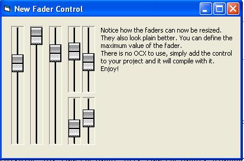



## Fader / Mixer Control

### Description

New version of my fader control! A fader is like a slider, only it looks like those things on mixing desks. No OCX needed, just add this tiny (4kb zipped) control to your project and you can use it from the toolbox. It is transparent, so it will go with whatever color scheme you choose. It also is now resizable, and you can set its bordercolors. enjoy!
 
### More Info
 

             |
---                |---
**Submitted On**   |2002-07-14 10:31:50
**By**             |[mike payne](https://github.com/Planet-Source-Code/PSCIndex/blob/master/ByAuthor/mike-payne.md)
**Level**          |Beginner
**User Rating**    |4.9 (34 globes from 7 users)
**Compatibility**  |VB 4\.0 \(32\-bit\), VB 5\.0, VB 6\.0
**Category**       |[Custom Controls/ Forms/  Menus](https://github.com/Planet-Source-Code/PSCIndex/blob/master/ByCategory/custom-controls-forms-menus__1-4.md)
**World**          |[Visual Basic](https://github.com/Planet-Source-Code/PSCIndex/blob/master/ByWorld/visual-basic.md)
**Archive File**   |[Fader\_\_\_Mi1059857142002\.zip](https://github.com/Planet-Source-Code/mike-payne-fader-mixer-control__1-36865/archive/master.zip)

